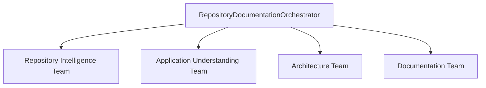

# Agents

## Root Orchestrator
`RepositoryDocumentationOrchestrator`

## Repository Intelligence Team
- `RepositoryScannerAgent`
- `StackDetectionAgent`
- `RepositoryMapperAgent`
- `DependencyAgent`
- `CodeIntelligenceAgent`

## Application Understanding Team
- `BusinessLogicAgent`
- `APIAnalysisAgent`
- `DatabaseAnalysisAgent`
- `WorkflowAgent`

## Architecture Team
- `ArchitectureAgent`
- `DiagramAgent`

## Documentation Team
- `RunbookAgent`
- `DocumentationAgent`
- `ReviewerAgent`

## Deterministic vs Agent Responsibilities
**Deterministic services:** scanning, hashing, git metadata, AST parsing, Tree-sitter extraction, Graphify invocation, git diffing, evidence extraction.

**Agents/LLMs:** business interpretation, architecture synthesis, workflow explanation, documentation writing, and review.

## Model Alias Strategy
- `fast`: quick classification and lightweight lookups
- `code`: code-intensive analysis
- `reasoning`: synthesis and architecture reasoning
- `documentation`: long-form structured writing
- `reviewer`: artifact review and consistency checks

