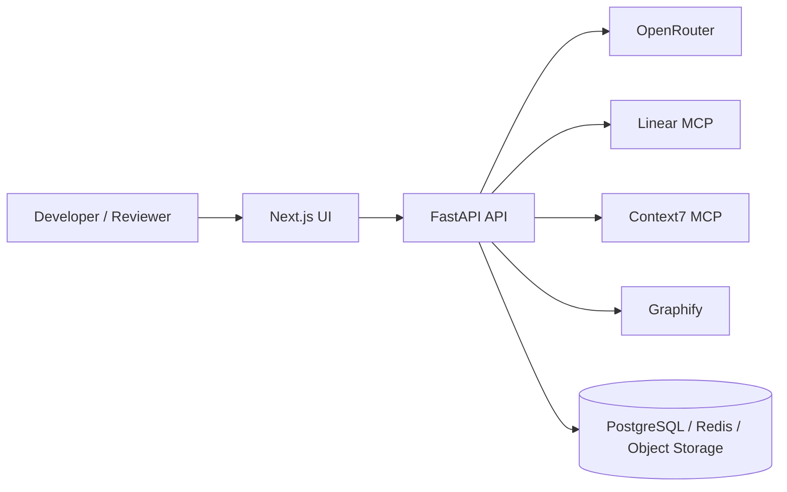
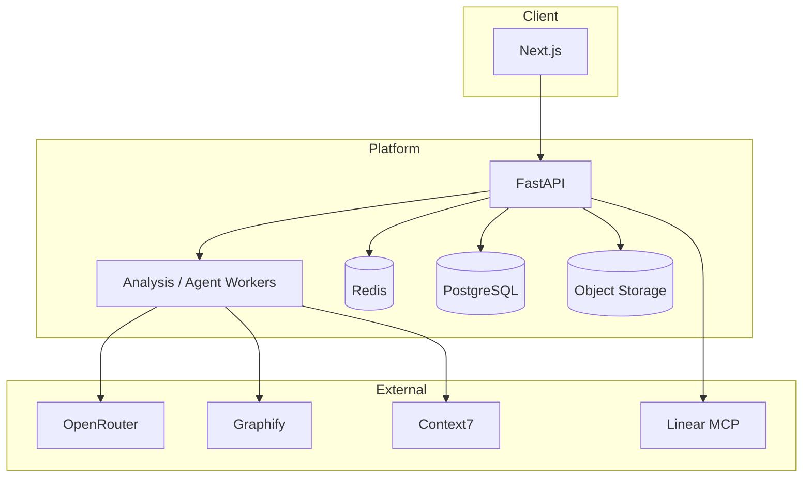
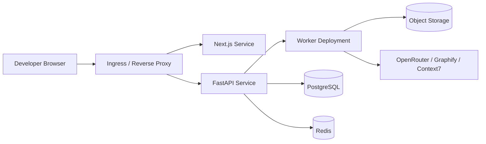
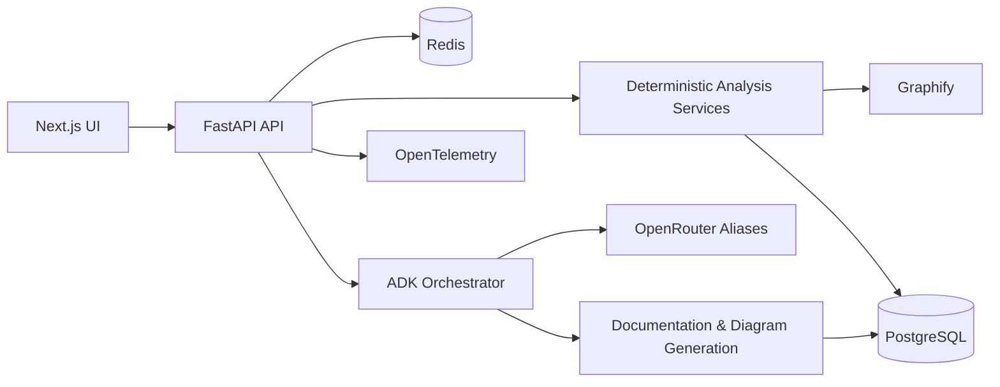

# Architecture

## 1. High-Level System Architecture
The platform ingests a repository, performs deterministic analysis, builds a repository knowledge model, routes contextual evidence to specialist AI agents, and produces reviewable documentation and Q&A outputs.

### System Context Diagram

## 2. Frontend Layer
Next.js + TypeScript dashboard for repository intake, architecture exploration, evidence inspection, documentation browsing, and grounded Q&A.

## 3. API Layer
FastAPI exposes repository intake, scan control, findings retrieval, document generation, Q&A, and task/status endpoints.

## 4. Google ADK Orchestration Layer
ADK coordinates the orchestrator and specialist agents, but only after deterministic extraction and evidence packaging.

## 5. Deterministic Analysis Layer
Python services handle file scanning, hashing, stack detection, AST parsing, symbol extraction, dependency discovery, Graphify invocation, and git metadata collection.

## 6. Repository Knowledge Layer
PostgreSQL stores repositories, scans, findings, evidence, tasks, and generated documents. Redis supports caching, queues, and ephemeral session state.

## 7. Graphify Integration
Graphify provides graph-backed structural context for modules, relationships, and change impact; repository evidence remains the governing source.

## 8. Context7 Integration
Context7 provides current external framework documentation to support design and implementation guidance.

## 9. Linear Integration
Linear is optional and is used only for MVP/phase/task planning and delivery-state tracking.

## 10. OpenRouter Model Gateway
Model access is abstracted behind aliases: `fast`, `code`, `reasoning`, `documentation`, and `reviewer`.

## 11. Database / Cache / Object Storage
PostgreSQL is the system of record, Redis backs async workflows, and object storage is reserved for large generated artifacts.

## 12. Observability
OpenTelemetry spans repository ingestion, parsing, graph enrichment, agent execution, and document generation.

## 13. Security Boundaries
Repository content is untrusted, execution is sandboxed, credentials remain server-side, and prompt-injection defenses treat repository text as hostile input.

## 14. Deployment Architecture
Docker Compose is the MVP deployment target; Kubernetes is deferred until scale and operational requirements justify it.

### Container Architecture

### Deployment Diagram

## 15. Mermaid Diagram

## Architecture Principle
`Parse -> Structure -> Build Relationships -> Retrieve Relevant Context -> AI Reasoning -> Evidence Validation -> Documentation`
