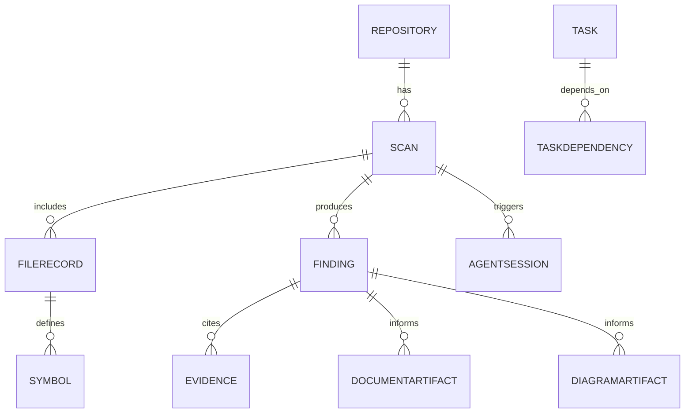

# Data Model

## Core Entities
- Repository
- Scan
- FileRecord
- Symbol
- Finding
- Evidence
- AgentSession
- DocumentArtifact
- DiagramArtifact
- Task
- TaskDependency

## Notes
- `Finding` stores `classification` (`extracted`, `inferred`, `ambiguous`) and `confidence` (`high`, `medium`, `low`).
- `Evidence` stores file path, symbol, and line spans.
- `AgentSession` records alias, inputs, outputs, cost, timing, and retry metadata.

