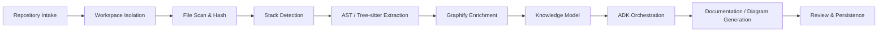
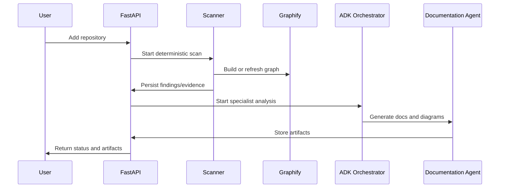

# System Design

## Repository Ingestion Flow
Register repository metadata, allocate an isolated workspace, snapshot git state, and enqueue analysis.

### Repository Analysis Pipeline

## Sandbox Strategy
Treat repository content as untrusted, disable hooks, disallow arbitrary script execution, and keep credentials outside the workspace.

## File Scanning
Walk tracked files, hash content, identify languages, and record size/type metadata before deeper analysis.

## Stack Detection
Use lockfiles, manifests, imports, and tool metadata as evidence-backed indicators.

## AST / Tree-sitter Extraction
Parse supported languages into symbols, references, dependency edges, and candidate business rules.

## Graphify Graph Building
Send curated repository structure to Graphify, then merge graph outputs back into the knowledge model as graph context.

## Repository Knowledge Model
Normalize repositories, scans, files, symbols, findings, evidence, documents, diagrams, and task artifacts.

## ADK Orchestration
Orchestrator packages evidence slices and dispatches them to specialist agents with model aliases and guardrails.

## Model Routing
Route cheap lookups to `fast`, code-intensive tasks to `code`, architecture synthesis to `reasoning`, writing to `documentation`, and checks to `reviewer`.

## Finding / Evidence Model
Each finding stores classification, confidence, evidence spans, optional external context, and producing actor metadata.

## Documentation Generation
DocumentationAgent writes structured markdown from approved findings and templates.

## Diagram Generation
DiagramAgent converts architecture and data relationships into Mermaid definitions with evidence references.

## Reviewer Flow
ReviewerAgent checks generated artifacts for unsupported claims, missing evidence, and template drift.

## Artifact Storage
Markdown lives in git-backed storage; large exports and future binaries can live in object storage.

## Repository Q&A
Retrieval pulls grounded evidence spans plus relevant generated documents before any model answer.

## Incremental Analysis
Re-scan only changed files, update impacted graph segments, and invalidate affected findings.

## Failure / Retry Handling
Retry transient external calls with jittered backoff; mark deterministic parse failures as explicit findings, not silent drops.

## Security
Restrict tool permissions, validate paths, sanitize archive inputs, and redact sensitive content in logs.

## Observability
Trace scan stages, collect queue metrics, and log evidence lineage for generated outputs.

